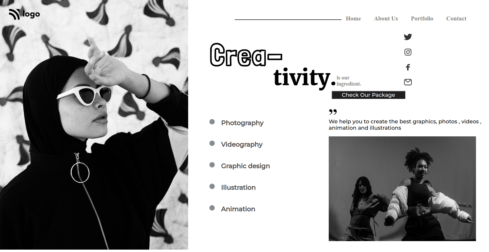

## My Name

### JYOTI SINGH

## PROJECT NAME

### Dance Home Page

## About

- ### Used HTML And CSS.
- ### Style by flex-box .
- ### Responsive.

## WHAT I LEARN FROM THIS PROJECT?

- ### Practicing on Media Query.
- ### This is very tough to fix every thing , i worked so much to make it responsive by exploring more on the font , image, div-container etc on changing there size according to the width of the screen size.
- ### 2 times of code-modification done.

## TIME TAKEN TO COMPLETE

- ### First-time it takes more then 1day.
- ### second-time it takes 7hour modification.

## PHOTOS

### WEBSITE LINK

[Visit Link](https://dance-home-page-01.netlify.app/)
